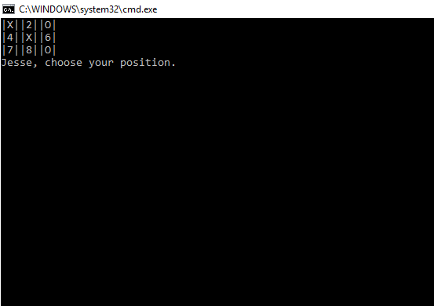

# Lab04-Tic-Tac-Toe

## About this project
This program is a tic-tac-toe game. The game is initialized by using separate class files to create a new game and new user. Once the game starts, the user names for player one and two are stored. The players then take turns playing tic-tac-toe until there is a winner, or a draw. The user inputs are stored as separate strings, which are evaluated against the winning conditions each turn.

## Example

## How to use
This program requires Visual Studio. Once the repo has been cloned to the user's local machine, they simply need to navigate to the solution folder, and open the solution using Visual Studio. Then, run the program.cs file. After that, follow the prompts. The test file can be opened via the test solution also located in the project directory.

## Licensing
This program is available under the MIT license.